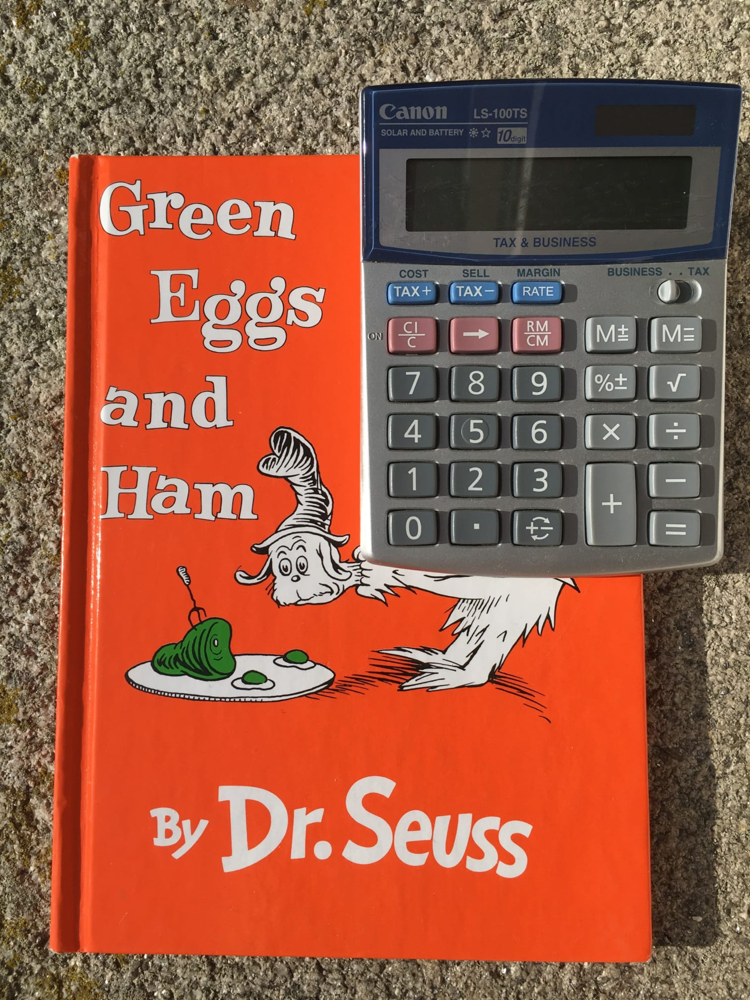

% Plain Text Accounting portal

<!--
Editing tips:

This is whatever markdown Cloudflare Sites renders.
index.tmpl defines the page layout, using normalize, skeleton and local css.
(http://getskeleton.com)

If editing via github web UI:
- you can see an approximate preview with the Preview tab

If editing in a local clone:
- you can use make html-watch to see an accurate preview

If using emacs markdown-mode:
- S-TAB cycles heading/content visibility
- TAB on a heading cycles visibility of that section
- C-x n s/C-x n w on a heading narrows to/widens from that section

-->

# plain text accounting

***Plain text accounting*** is a way of doing bookkeeping and accounting 
with plain text files and scriptable, command-line-friendly software, such as
[Ledger, hledger, or Beancount](#pta-apps).

Welcome!
This site together with [wiki.plaintextaccounting.org](https://wiki.plaintextaccounting.org)
is an entry point to the PTA community's tools, docs and practices. 
It is [maintained](README.html) by 
Simon&nbsp;Michael (hledger project leader, Ledger contributor, PTA fan) and contributors like you. 
Updates are helpful; join the [chat](#news-discussion)
or [send an edit](https://github.com/plaintextaccounting/plaintextaccounting/edit/master/index.md).
[{title="send pull requests, bug reports, blog posts, star us, tweet with #plaintextaccounting tag"}](https://github.com/plaintextaccounting/plaintextaccounting)

Overview:
\
<small>
*2022-06: FAQs and Common Tasks links have moved to the wiki.*
</small>

**What is this ?**
... [Newcomer FAQ](https://wiki.plaintextaccounting.org/Newcomer-FAQ)
... [Objections and Concerns](https://github.com/plaintextaccounting/plaintextaccounting/wiki/Newcomer-FAQ#objections-and-concerns)
... [Getting started FAQ](https://wiki.plaintextaccounting.org/Getting-started-FAQ)

**[Tools](#tools)**
... [PTA apps](#pta-apps)
... [Editor support](#editor-support)
... [Data import/conversion](#data-importconversion)
... [Price fetching](#price-fetching)
... [Data generation](#data-generation)
... [Reports](#reports)
... [Time logging](#time-logging)
... [UI, console](#ui-console)
... [UI, curses](#ui-curses)
... [UI, GUI](#ui-gui)
... [UI, web](#ui-web)
... [UI, mobile](#ui-mobile)
... [API](#api)

**[Docs](#docs)**
... [Accounting](#accounting)
... [Plain Text Accounting](#plain-text-accounting-1)
... [Presentations](#presentations)
... [Wiki/Cookbook](https://wiki.plaintextaccounting.org)

**[Videos](#videos)**
...
\
**[Articles & blog posts](#articles-blog-posts)**
...
\
**[News & discussion](#news-discussion)**
...

\
\

## Tools

### PTA apps

To do Plain Text Accounting, choose one of the apps below.
Generally it's relatively easy to migrate data from one to another.

<!-- Syntax: http://pandoc.org/README.html#tables -->
<!-- Leading |'s let markdown-mode realign the table with TAB, but screw up fontification. Hmm, maybe fixed ? Try it. -->
<!-- Active projects are sorted by committers+other community size/activity signals; inactives are sorted by start date. -->
<!-- Committers count can be eg the "Contributors" count on github. -->

| Project              | Start  | Last release | Code                              | Committers | Stars | Mail list, ~size                 | Chat, ~size                                                                                                   |
|----------------------|--------|:------------:|-----------------------------------|-----------:|------:|----------------------------------|---------------------------------------------------------------------------------------------------------------|
|                      | &nbsp; |              |                                   |            |       |                                  |                                                                                                               |
| **Popular**          |        |              |                                   |            |       |                                  |                                                                                                               |
| [Ledger]             | 2003   | 2021-05      | [C++][ledger-gh]                  |        189 |  4.3k | [ledger][ledger-mail] ~900       | [irc][#ledger:libera.chat] 60                                                                                 |
| [hledger]            | 2007   | 2022-06      | [haskell][hledger-gh]             |        148 |  2.1k | [hledger][hledger-mail] ~200     | [matrix][#hledger:matrix.org]/[irc][#hledger:libera.chat] 120                                                 |
| [Beancount]          | 2008   | 2020-06      | [python][beancount-gh]            |         64 |    2k | [beancount][beancount-mail] ~600 | [irc][#beancount:libera.chat] 20, [fava gitter][beancount-fava-gitter]/[matrix][#beancount_fava:gitter.im] 40 |
|                      | &nbsp; |              |                                   |            |       |                                  |                                                                                                               |
| **Smaller userbase** |        |              |                                   |            |       |                                  |                                                                                                               |
| Abandon              | 2013   | 2019-09      | [scala][abandon-gh]               |         11 |   162 |                                  | [gitter][abandon-gitter]/[matrix][#hrj_abandon:gitter.im]                                                     |
| Transity             | 2018   | 2019-05      | [purescript][transity-gh]         |          8 |   571 |                                  | [gitter][transity-gitter]/[matrix][#feramhq_transity:gitter.im]                                               |
| Ledger in Go         | 2013   | 2019-11      | [go][ledger-in-go-gh]             |          8 |   323 |                                  |                                                                                                               |
| rust\_ledger         | 2019   | 2020-09      | [rust][rust_ledger-gh]            |          4 |    90 |                                  |                                                                                                               |
| .Net Ledger          | 2017   | 2018-08      | [C#][nledger-gh]                  |          1 |   134 |                                  | [gitter][nledger-gitter]/[matrix][#nledger_Lobby:gitter.im]                                                   |
| goledger             | 2019   |              | [go][goledger-gh]                 |          1 |    23 |                                  |                                                                                                               |
| blossom              | 2020   |              | [F#][blossom-gh]                  |          1 |    20 |                                  |                                                                                                               |
| [Tackler]            | 2017   | 2021-01      | [scala][tackler-gl]               |          1 |     8 |                                  | [gitter][tackler-gitter]/[matrix][#E257-FI_tackler:gitter.im]                                                 |
| [ledg]               | 2021   | 2021-04      | [javascript][ledg]                |          1 |    30 |                                  |                                                                                                               |
| [pta]                | 2020   | 2020-09      | perl                              |          1 |       |                                  |                                                                                                               |
| [Prudent]            | 2018   |              | js (closed); [addons][prudent-gh] |          1 |       |                                  | [\@PrudentLedger][prudent-chat]                                                                               |
| knut                 | 2020   |              | [go][knut-gh]                     |          3 |    39 |                                  |                                                                                                               |
|                      | &nbsp; |              |                                   |            |       |                                  |                                                                                                               |
| **Inactive**         |        |              |                                   |            |       |                                  |                                                                                                               |
| bankroll             | 2020   | 2020-08      | [rust][bankroll-gl]               |          1 |     1 |                                  |                                                                                                               |
| acc                  | 2020   |              | [rust][acc-gh]                    |          1 |     1 |                                  |                                                                                                               |
| [beans]              | 2019   | 2019         | [haskell][beans-gh]               |            |       |                                  |                                                                                                               |
| [monescript]         | 2017   | 2018-01      | [javascript][monescript-gh]       |          1 |    12 |                                  |                                                                                                               |
| uledger              | 2015   |              | [python][uledger-gh]              |            |       |                                  |                                                                                                               |
| pacioli              | 2013   |              | [python][pacioli-gh]              |            |       |                                  |                                                                                                               |
| ledger.pl            | 2013   |              | [perl][ledger.pl-gh]              |            |       |                                  |                                                                                                               |
| Penny                | 2012   | 2014         | [haskell][penny-gh]               |            |       |                                  |                                                                                                               |
| UMM                  | 2009   | 2010         | [haskell][UMM-hackage]            |            |       |                                  |                                                                                                               |
| sm-Ledger            | 2007   |              | [squeak smalltalk][smalltalk-gh]  |            |       |                                  |                                                                                                               |
| cl-ledger            | 2007   |              | [common lisp][cl-ledger-gh]       |          4 |    66 |                                  |                                                                                                               |

[plaintextaccounting.org]: https://plaintextaccounting.org
[/r/plaintextaccounting]: https://www.reddit.com/r/plaintextaccounting
[#plaintextaccounting:libera.chat]: https://web.libera.chat/#plaintextaccounting
[#plaintextaccounting:matrix.org]: https://matrix.to/#/#plaintextaccounting:matrix.org

[abandon-gh]: https://github.com/hrj/abandon
[abandon-gitter]: https://gitter.im/hrj/abandon
[#hrj_abandon:gitter.im]: https://matrix.to/#/#hrj_abandon:gitter.im

[acc-gh]: https://github.com/rudolfschmidt/acc

[Beancount]: https://github.com/beancount/
[Beancount2]: https://beancount.github.io
[beancount-gh]: https://github.com/beancount/beancount/
[beancount-mail]: https://groups.google.com/forum/#!forum/beancount
[#beancount:libera.chat]: https://web.libera.chat/#beancount

[beancount-fava-gitter]: https://gitter.im/beancount/fava
[#beancount_fava:gitter.im]: https://gitter.im/beancount/fava

[beans]: https://sboehler.github.io/beans
[beans-gh]: https://github.com/sboehler/beans

[blossom-gh]: https://github.com/blossom-hub/blossom

[cl-ledger-gh]: https://github.com/ledger/cl-ledger

[goledger-gh]: https://github.com/mescanne/goledger

[hledger]: https://hledger.org
[hledger-gh]: https://github.com/simonmichael/hledger
[hledger-code]: http://code.hledger.org
[hledger-mail]: http://mail.hledger.org/
[#hledger:matrix.org]: https://matrix.to/#/#hledger:matrix.org
[#hledger:libera.chat]: https://web.libera.chat/#hledger

[knut-gh]: https://github.com/sboehler/knut

[Ledger]: https://www.ledger-cli.org
[ledger-gh]: https://github.com/ledger/ledger
[#ledger:libera.chat]: https://web.libera.chat/#ledger
[ledger-mail]: http://list.ledger-cli.org/

[ledger-in-go-gh]: https://github.com/howeyc/ledger

[ledger.pl-gh]: https://github.com/dimonf/ledger.pl

[monescript]: https://monescript.github.io/
[monescript-gh]: https://github.com/monescript/monescript

[nledger-gh]: https://github.com/dmitry-merzlyakov/nledger
[nledger-gitter]: https://gitter.im/nledger/lobby
[#nledger_Lobby:gitter.im]: https://matrix.to/#/#nledger_Lobby:gitter.im

[pacioli-gh]: https://github.com/mdipierro/pacioli

[penny-gh]: https://github.com/massysett/penny

[pta]: https://mandoc.bsd.lv/pta

[prudent]: https://prudent.me
[prudent-gh]: https://github.com/PrudentMe
[prudent-chat]: https://twitter.com/PrudentLedger

[rust_ledger-gh]: https://github.com/ebcrowder/rust_ledger

[bankroll-gl]: https://gitlab.com/dantuck/bankroll

[smalltalk-gh]: https://gist.github.com/simonmichael/bb611dba654ccb1573e1

[Tackler]: https://tackler.e257.fi
[tackler-gl]: https://gitlab.com/e257/accounting/tackler
[tackler-gitter]: https://gitter.im/E257-FI/tackler
[#E257-FI_tackler:gitter.im]: https://matrix.to/#/#E257-FI_tackler:gitter.im

[transity-gh]: https://github.com/feramhq/transity
[transity-gitter]: https://gitter.im/feramhq/transity
[transity-demo]: https://www.feram.io/transity
[#feramhq_transity:gitter.im]: https://matrix.to/#/#feramhq_transity:gitter.im

[uledger-gh]: https://github.com/danpat/uledger

[UMM-hackage]: http://hackage.haskell.org/package/UMM

[ledg]: https://github.com/SitanHuang/ledg

<!-- [compare at openhub](https://www.openhub.net/p/_compare?project_0=Ledger&project_1=hledger&project_2=beancount) -->

### Editor plugins

Helpers which make your text editor or IDE more aware of PTA apps and file formats.
These often also work well for PTA apps other than the one they are named for.

**Atom**
[language-ledger](https://atom.io/packages/language-ledger),
[ledger](https://atom.io/packages/ledger)
\
**Emacs**
[beancount-mode](https://bitbucket.org/blais/beancount/src/1e21b27c0b0ecf2bf2e1a2cd5c3da3b1befc8152/src/elisp/beancount.el?at=default&fileviewer=file-view-default),
[hledger-mode](https://github.com/narendraj9/hledger-mode),
[ledger-mode](https://www.ledger-cli.org/3.0/doc/ledger-mode.html)
\
**IntelliJ**
[Ledger Plugin](https://plugins.jetbrains.com/plugin/15405-ledger-cli)
\
**Nano**
[scopatz/nanorc](https://github.com/scopatz/nanorc/blob/master/ledger.nanorc)
\
**Sublime**
[sublime-ledger-syntax](https://github.com/moeffju/sublime-ledger-syntax)
\
**TextMate**
[Ledger.tmbundle](https://github.com/lifepillar/Ledger.tmbundle)
\
**VIM**
[vim-ledger](https://github.com/ledger/vim-ledger),
[vim-beancount](https://github.com/nathangrigg/vim-beancount),
[hledger-vim](https://github.com/anekos/hledger-vim)
\
**VS Code**
[hledger-vscode](https://github.com/mhansen/hledger-vscode),
[ledger](https://marketplace.visualstudio.com/items?itemName=mariosangiorgio.ledger),
[vscode-beancount](https://marketplace.visualstudio.com/items?itemName=Lencerf.beancount)

### Data import/conversion

Additional helper tools complementing the PTA apps, by category.

- [Ledger](https://www.ledger-cli.org/3.0/doc/ledger3.html#Comma-Separated-Values-files) and [hledger](https://hledger.org/csv.html) have CSV conversion built in. Also:
- bean-identify, bean-extract, bean-file - Beancount built-in tools
- [banks2ledger](https://github.com/tomszilagyi/banks2ledger) - CSV to *ledger converter
- [beancount-import](https://github.com/jbms/beancount-import) web app/framework for converting various formats to beancount (python)
- [beancount-ynab](https://github.com/hoostus/beancount-ynab) You Need A Budget to beancount converter
- [buchhaltung](http://hackage.haskell.org/package/buchhaltung) CSV/FinTS/HBCI/OFX to *ledger conversion/deduplication (haskell)
- [csv2beancount](https://github.com/PaNaVTEC/csv2beancount) CSV to beancount converter (clojure)
- [CSV2Ledger](https://launchpad.net/csv2ledger) CSV to *ledger converter (perl)
- [fints2ledger](https://github.com/MoritzR/fints2ledger) FinTS/HBCI to csv to *ledger or beancount journals (python)
- [gcash2ledger.py](https://gist.github.com/nonducor/ddc97e787810d52d067206a592a35ea7/) GNUCash XML to *ledger converter (python)
- [gnucash-to-beancount](https://github.com/henriquebastos/gnucash-to-beancount/) GNUCash sqlite to beancount converter (python)
- [gnucash2ledger.py](https://github.com/MatzeB/pygnucash/blob/master/gnucash2ledger.py) GNUCash sqlite to *ledger converter (python)
- [grisbi2Ledger](https://github.com/Hawk777/grisbi2ledger) Grisbi to *ledger converter
- [hledger-import-dsl](https://github.com/hpdeifel/hledger-import-dsl) alternate, programmable CSV converter for hledger
- [hledger-to-influxdb](https://github.com/barrucadu/hledger-scripts#hledger-to-influxdb) hledger to InfluxDB converter (haskell)
- [hledger2beancount](https://github.com/tjroth/hledger2beancount) hledger to beancount converter (haskell)
- [homebank2ledger](https://github.com/chazmcgarvey/homebank2ledger) HomeBank to ledger and beancount converter (perl)
- [icsvledger](https://github.com/quentinsf/icsv2ledger) interactive CSV to *ledger converter (python)
- [into-ledger](https://github.com/manishrjain/into-ledger) CSV to *ledger converter
- [jali](https://git.darmstadt.ccc.de/jali/jali) downloader/importer to *ledger (python)
- [kmymoney2hledger](https://github.com/maridonkers/kmymoney2hledger) KMyMoney to *ledger converter (clojure)
- [kmymoney2ledgers](https://github.com/isabekov/kmymoney2ledgers) KMyMoney to *ledger/beancount converter (python)
- [kmymoney2ledgers.awk](https://github.com/isabekov/kmymoney2ledgers.awk) KMyMoney to *ledger/beancount converter (Awk)
- [ldgclip](https://gitlab.com/IanTwenty/ldgclip) import bank transactions via the clipboard with one click (bash/awk)
- [Ledger in Go](https://github.com/howeyc/ledger) has limport, a CSV to *ledger converter
- [ledger-autosync](https://gitlab.com/egh/ledger-autosync) OFX download, OFX to *ledger conversion, deduplication
- [ledger-guesser](https://github.com/j3k0/ledger-guesser) neural network for generating entries like past ones, can be used with ledger-autosync (javascript)
- [ledger-myexpenses](https://github.com/ony/ledger-myexpenses) MyExpenses android app sqlite db to *ledger conversion (python)
- [ledger-to-beancount](https://github.com/glasserc/ledger-to-beancount/) yet another simple ledger to beancount converter (python)
- [ledger-tutorials](https://github.com/tlvince/ledger-tutorials) convert Pete Keen's tutorials to ebook format
- [ledger2beancount.py](https://gist.github.com/travisdahlke/71152286b0a8826249fe) *ledger to beancount converter
- [ledger2beancount](https://github.com/beancount/ledger2beancount)/[beancount2ledger](https://github.com/beancount/beancount2ledger) the best converter between h/ledger and beancount formats (perl).
- [outofit](https://github.com/rcaputo/outofit) QuickBooks to *ledger converter
- [piecash](https://github.com/sdementen/piecash) GNUCash SQL to *ledger converter (python)
- [plaid2qif](https://github.com/ebridges/plaid2qif) Download transactions from plaid as QIF or CSV files
- [plaid2text](https://github.com/madhat2r/plaid2text) Plaid API to *ledger/beancount download/conversion
- [qb2ledger](https://gist.github.com/genegoykhman/3765100) QuickBooks General Journal CSV to *ledger converter
- [QIFtoLedger](https://github.com/Kolomona/QIFtoLedger) (Bank of America's) QIF to *ledger converter
- [reckon](https://github.com/cantino/reckon) smart interactive/non-interactive CSV to *ledger converter
- [slc](https://github.com/marvinpinto/slc) generates Ledger accounting entries, works with generic CSV files as well as the Stripe API
- [smart_importer](https://github.com/johannesjh/smart_importer) library for building smarter CSV to beancount/Fava converters
- [total_recall](https://github.com/eval/total_recall) CSV to *ledger converter
- [ynab-to-ledger](https://github.com/vermiceli/ynab-to-ledger) You Need A Budget (YNAB) to *ledger converter. Handles multiple currencies, multiple number formats, reconciliation, memos, transfers, and split transactions
- [ynab_to_ledger](https://github.com/pgr0ss/ynab_to_ledger) You Need A Budget to *ledger converter
- [Costflow](https://docs.costflow.io) convert one line message to beancount/*ledger format
- [Go Ledger parser](https://github.com/abourget/ledger) a parser and ledgerfmt, ledger2json, json2ledger tools (go)

### Price fetching

- [bean-price](https://docs.google.com/document/d/1thYRAMell_QT1Da1F_laprSs6BlROZjyK_h3V8qHW9c) Beancount's price fetching tool (python)
- [hledger-stockquotes](https://github.com/prikhi/hledger-stockquotes) download market prices for your hledger commodities (haskell)
- [ledger-get-prices](https://github.com/nathankot/ledger-get-prices) download market prices (ruby)
- [LedgerStockUpdate](https://github.com/adchari/LedgerStockUpdate) update a Ledger price database (go)
- [market-prices](https://github.com/barrucadu/hledger-scripts#market-prices) download market prices from several sources (python)
- [market-prices.hs](https://gist.github.com/maralorn/a288329af50955dff353e5529f377488) small, easy to adapt script to scrape market data from the internet (Haskell)
- [pricehist](https://gitlab.com/chrisberkhout/pricehist) fetch and format historical price data, with support for multiple sources and output formats (python)
- [the-solipsist/scripts](https://github.com/the-solipsist/scripts/) download prices for your hledger commodities, including indian commodities (bash)
- [update-hledger-market-prices.hs](https://github.com/cdepillabout/docs/blob/master/code/update-hledger-market-prices.hs) download market prices (haskell)

### Data generation

- [beancount-extract-price](https://github.com/Mayeu/beancount-scripts) generate prices transactions based on your beancount ledger (python)
- [DepreciateForLedger](https://github.com/tazzben/DepreciateForLedger) generate *ledger depreciation transactions (python)
- [hledger-interest](http://hackage.haskell.org/package/hledger-interest) generate *ledger interest entries (haskell)
- [ledgerbil](https://github.com/scarpent/ledgerbil) schedule recurring txns, interactive reconcile, date sorting
- [LedgerScheduler](https://github.com/tazzben/LedgerScheduler) move entries from one file to another when they come due (python)
- [lotter](https://src.d10.dev/lotter) generate postings for capital gain/loss (go)
- [recurring](http://hub.darcs.net/simon/ledgertools/browse/recurring) generate recurring *ledger entries (python)
- [reorder-journal.sh](https://github.com/amitaibu/hledger-example/blob/master/reorder-journal.sh) sort hledger entries, preserving directives/comments at top of file (bash)
- [sassetti](https://github.com/jvasile/sassetti) adds lisp macros to ledger files (common lisp)

### Reports

- [budget_report](https://github.com/sulemankm/budget_report) budget reporting with beancount (python)
- [hledger-diff](http://hackage.haskell.org/package/hledger-diff) report differing transactions between two journals (haskell)
- [hledger-irr](http://hackage.haskell.org/package/hledger-irr) calculate an account's internal rate of return (superseded by [roi](https://hledger.org/hledger.html#roi)) (haskell)
- [hledger-vega](https://github.com/xitian9/hledger-vega) makes configurable [vega-lite](https://vega.github.io/vega-lite/) charts from hledger (shell)
- [hreports](https://pypi.org/project/hreports) customise hledger reports with templates and PDF output (python)
- [ledger-plot](https://github.com/Tagirijus/ledger-plot) interactive tool for making GNUplot charts from Ledger (python)
- [ledger-plots](https://github.com/esovetkin/ledger-plots) R package & script to make charts from Ledger (R)
- [ludget](https://pypi.org/project/ludget) generate charts from Ledger (python)
- [r-ledger](https://github.com/trevorld/r-ledger) an R package for reading and reporting on ledger/hledger/beancount files (R)
- [TaxingLots](https://framagit.org/jkepler/TaxingLots) calculates capital gains for a ledger journal (python)

### Time logging

- [org2tc](https://github.com/jwiegley/org2tc) org to timeclock converter
- [on-modify.timetrack.py](https://gist.github.com/wbsch/d977b0ac29aa1dfa4437) taskwarrior hook for timeclock output
- [t](https://github.com/nuex/t) ledger timeclock shellscript
- [tim](https://github.com/MatthiasKauer/tim) time logging/reporting tool using hledger
- [timekeeping-template](https://github.com/bbarker/timekeeping-template) time logging/reporting examples/how-to using hledger
- [tito](https://mostlyabsurd.com/files/tito) time logging bash scripts that avoid double clock-in

### UI, console

- [bean-add](https://github.com/simon-v/bean-add) interactive transaction entry tool (python)
- [hledger add](https://hledger.org/hledger.html#add) interactive transaction entry tool (builtin command)
- [ladd](https://github.com/ninewise/dotfiles/blob/master/local/bin/ladd) create and edit a new *ledger transaction by fuzzy-matching past descriptions
- [ldgr](https://github.com/brandonpittman/ldgr) command line tool to add/sort/tag ledger files (ruby)
- [ledger xact](https://www.ledger-cli.org/3.0/doc/ledger3.html#xact) history-aware transaction generator (builtin command)

### UI, curses

- [hledger-iadd](https://github.com/hpdeifel/hledger-iadd) TUI for *ledger transaction entry (haskell)
- [hledger-ui](http://hackage.haskell.org/package/hledger-ui) TUI for *ledger browsing (haskell, [video](https://asciinema.org/a/29665))
- [ledger-add](https://github.com/Tagirijus/ledger-add) TUI for *ledger transaction entry (python)
- [regdel](https://github.com/guillaumechereau/regdel) TUI for browsing Ledger files (python)

### UI, GUI

- [ledgerble](https://github.com/sbridges/ledgerble) reporting GUI with charts & adjustable reports (Javascript)
- [ledgerhelpers](https://github.com/Rudd-O/ledgerhelpers) misc. GUI tools + helper library (Python, GTK)
- [Prudent][prudent] integrated journal editing/importing/reporting GUI for Ledger (Javascript, mac only, closed source)

### UI, web

- [fava](https://github.com/beancount/fava) web UI for beancount browsing (python, [demo](http://fava.pythonanywhere.com/))
- [hledger-web](http://hackage.haskell.org/package/hledger-web) web UI for *ledger browsing, data entry 
  (haskell, 
   [demo](http://demo.hledger.org), 
   [Sandstorm app](https://apps.sandstorm.io/app/8x12h6p0x0nrzk73hfq6zh2jxtgyzzcty7qsatkg7jfg2mzw5n90))
- [Ledger in Go](https://github.com/howeyc/ledger) web UI for browsing ledger transactions, reports, and porfolios
- [Ledger Web](https://github.com/peterkeen/Ledger-Web) ledger HTML reporting system (ruby, postgres)
- [Ledger Web](https://vifon.github.io/ledger-web) web UI/API for ledger browsing, data entry (python)
- [ledger-analytics](https://github.com/kendricktan/ledger-analytics) web UI for ledger data analytics (javascript)
- [ledger-dashboard](https://github.com/Ikke/ledger-dashboard) web UI for ledger browsing, data entry (python)
- [ledger-pyreport](https://yingtongli.me/git/ledger-pyreport/about/) web UI for standard accounting statements and unrealised gains (python)
- [ledgeraccounting](https://github.com/thecount2a/ledgeraccounting) web UI for hledger: data entry, basic reports and budgets (javascript)
- [ledgible](https://github.com/lipidity/ledgible) web UI for ledger browsing, data entry (python)
- [node-ledger-web](https://github.com/slashdotdash/node-ledger-web) web UI for ledger browsing (javascript)
- [WealthPulse](https://github.com/readysetmark/WealthPulse) web UI for ledger browsing, price fetching (F#)

### UI, mobile

- [beancount-mobile](https://github.com/xuhcc/beancount-mobile) data entry app for beancount (Android, javascript)
- [cashier](https://gitlab.com/alensiljak/cashier) mobile or desktop client for ledger and hledger-web (Android/Desktop, javascript, [app](https://cashier.alensiljak.eu.org/))
- [cone](https://f-droid.org/en/packages/info.tangential.cone/) data entry app for the h/ledger format (Android, [dart](https://github.com/bradyt/cone))
- [MoLe](https://fossdroid.com/a/mole.html) mobile client for hledger-web (Android, [java](https://git.ktnx.net/?p=mobile-ledger.git))

### API

- [gledger](https://github.com/gledger/gledger) Go package to interface with Ledger (go)
- [hledger-lib](https://github.com/simonmichael/hledger/tree/master/hledger-lib) library for parsing and generating reports from *ledger files (haskell)
- [hledger-web](https://github.com/simonmichael/hledger/tree/master/hledger-web) the web app includes a JSON API server for *ledger files (haskell)
- [ledgerhelpers](https://github.com/Rudd-O/ledgerhelpers) extends Ledger's python library (python)
- [node-hledger](https://github.com/rstacruz/node-hledger) Node.js API for *ledger files (javascript)

<!--
other console/curses tools

- [Taskwarrior](http://taskwarrior.org) modern task manager
- [add / tapecalc](http://invisible-island.net/add/add.html) dynamically updating tape calculator
- [sc](http://www.linuxjournal.com/article/10699) spreadsheet
- [sc-im](https://github.com/andmarti1424/sc-im) update of sc
- [GNU PEM & Oleo](http://www.examiner.com/article/gnu-pem-oleo-two-great-command-line-text-based-financial-accounting-apps) expenses manager, spreadsheet
- the [org empire](http://orgmode.org)...
-->

## Docs

### Accounting

- [hledger: Accounting concepts](https://hledger.org/accounting.html)
- [Beancount: The Double-Entry Counting Method](https://docs.google.com/document/d/100tGcA4blh6KSXPRGCZpUlyxaRUwFHEvnz_k9DyZFn4)
- [Accounting for Computer Scientists](https://martin.kleppmann.com/2011/03/07/accounting-for-computer-scientists.html)
- [Accounting for Dragons](http://podcastle.org/2009/10/09/pc-miniature-38-accounting-for-dragons)

### Plain Text Accounting

PTA app official docs:

  [Ledger](https://www.ledger-cli.org/docs.html)
| [hledger](https://hledger.org/)
| [Beancount](https://beancount.github.io/docs/)
| [Ledger in Go](https://howeyc.github.io/ledger/)
| [Tackler](https://tackler.e257.fi/docs/)
| [pta](https://mandoc.bsd.lv/pta/)

PTA app comparisons:

- [hledger: hledger and other things](https://hledger.org/faq.html#hledger-and-other-things) 2014, 2019, 2022
- [Matthias Kauer: Command Line Accounting – A look at the various ledger ports](http://www.matthiaskauer.com/2015/08/command-line-accounting-a-look-at-the-various-ledger-ports/) 2015
- [beancount list: Another Ledger user's perspective](https://groups.google.com/d/msg/beancount/QV4qgpFbtJ8/9fSgMw-XGC8J) 2015
- [Beancount: A Comparison of Beancount and Ledger](https://docs.google.com/document/d/1dW2vIjaXVJAf9hr7GlZVe3fJOkM-MtlVjvCO1ZpNLmg) 2014
- [ledger list: ledger vs hledger vs beancount or how to choose the right cli client](https://groups.google.com/d/topic/ledger-cli/__yuMVjrOH0/discussion) 2014
- [Omari Norman: Why Penny](http://massysett.github.io/penny/why-penny.html) 2013
<!-- - [Fabrice Niessen: Why Ledger?](gone) 2010 -->

Cheatsheets:

- [Ledger CLI cheatsheet](https://devhints.io/ledger)
- [Beancount Syntax Cheat Sheet](https://beancount.github.io/docs/beancount_cheat_sheet.html)
- [Syntax Quick Reference for the Ledger-Likes](quickref/)

Introductory docs:

- [Getting Started With Ledger](https://rolfschr.github.io/gswl-book/latest.html)
- [hledger Getting Started Guide](https://hledger.org/start.html)
- [Getting Started with Beancount](https://beancount.github.io/docs/getting_started_with_beancount.html)
- [Tackler Quickstart](https://tackler.e257.fi/docs/quickstart/)
- [Don’t Sink Your First Attempts at Plaintext Accounting](https://wiki.plaintextaccounting.org/Don't-Sink-Your-First-Attempts-at-Plaintext-Accounting) syntax tips for beginners
- [Program your Finances: Command-line Accounting](https://www.petekeen.net/keeping-finances-with-ledger)
- [Plain Text Accounting Workshop](https://github.com/colindean/plaintextaccounting_workshop)
- [wiki: Getting started](https://github.com/plaintextaccounting/plaintextaccounting/wiki#getting-started)

### Presentations

- [Simon Michael: Inside hledger: an architectural tour and how-to](https://rawcdn.githack.com/simonmichael/hledger/4013a81af8dd2804c73ecac18fb3e7e4745a4275/doc/haskellerz/haskellerz.slidy.html) 2021
- [Michael Lynch](https://decks.mtlynch.io/plaintext-acccounting/) 2021
- [Andreas Pauley: Purely Functional Personal Finance](https://pauley.org.za/functional-finance-hledger/) 2018
- [Ledger CLI Accounting for Geeks](http://blog.loadingdata.nl/accounting-for-geeks/) 2014
- [Hacking Your Finances for Fun and Profit](http://matthewturland.com/slides/ledger-stats/) 2013
- [Ledger and Text based Accounting](http://www.adamsinfoserv.com/AISTWiki/pub/AIS/Presentations/Ledger.pdf) 2009

### Wiki/Cookbook

- [Wiki/Cookbook](https://wiki.plaintextaccounting.org) FAQs, howtos, more links

## Videos

- [Simon Michael: Inside hledger: an architectural tour and how-to](https://www.youtube.com/watch?v=6PKmZSHxu0c) 2021
- [hledger fan youtube channel](https://www.youtube.com/channel/UCZLxXTjOqLzq4z5Jy0AyWSQ) (short lessons) 2019
- [Quiliro Ordóñez: ledger-mode lightning talk](https://archive.org/details/ledger-mode_EmacsConf2019) 2019
- [Colin Dean: Plaintext Accounting with the ledger ecosystem](https://www.youtube.com/watch?v=FJtaM43PgXQ) 2017
- [Colin Dean: Plain Text Accounting](https://www.youtube.com/watch?v=8r5Cp66k4PA) 2017
- [Simon Michael: Hands-on with hledger](https://www.youtube.com/watch?v=H_CdGzLbc7A) 2016
- [Austin Walker: Conquering Your Finances with Emacs and Ledger](https://www.youtube.com/watch?v=cjoCNRpLanY) 2016
- [FLOSS Weekly 375: hledger](https://twit.tv/shows/floss-weekly/episodes/375)
  ([youtube](https://www.youtube.com/watch?v=Xjl-wVJcYpE),
  [3m overview](https://www.youtube.com/watch?v=qS2UcDV_lbs))
  2016
- [Evolution of ledger](https://www.youtube.com/watch?v=MGu1Bw2USQo) 2015
- [Evolution of hledger](https://www.youtube.com/watch?v=dEADGr9dqow) 2015
- [FLOSS Weekly 150: Ledger](https://twit.tv/shows/floss-weekly/episodes/150)
  ([youtube](https://www.youtube.com/watch?v=TDqrrH-gTt0)) 2011
- [Accounting course by Prof. Krug](https://www.youtube.com/playlist?list=PL259DBFA47F3B4761) 2011
- [Khan Academy: Accounting and financial statements](https://www.khanacademy.org/economics-finance-domain/core-finance/accounting-and-financial-stateme)
- [David Mitchell: Personal Debts](https://www.youtube.com/watch?v=9zyp8RF-Fyw)

## Articles & blog posts

### In 2021

- [Arsen Arsenović: Keeping track of finances from many places](https://www.aarsen.me/posts/2021-08-13-personal-finances-with-hledger.html) <!-- 2021-08-15 -->
- [Zoran Zaric: Budgeting for annual expenses with Hledger](http://rantsideasstuff.com/posts/2021/01/31-budgeting-for-annual-expenses-with-hledger/) <!-- 2021/01/31 -->
- [Samuel Walladge: Tracking capital gains with hledger](https://www.swalladge.net/archives/2021/01/30/hledger-tracking-capital-gains/) <!-- 2021/01/30 -->
- [Duarte O.Carmo: Hacking on my finances (Part 2: Beancount on Beanstalk)](https://duarteocarmo.com/blog/hacking-on-my-finances-part-2-beancount-on-beanstalk.html) <!-- 2021/01/15 -->

### In 2020

- [Duarte O.Carmo: Hacking on my finances](https://duarteocarmo.com/blog/hacking-on-my-finances.html) <!-- 2020/10/19 -->
- [Conversations in Code: Episode 3 / Introduction to Plain Text Accounting](https://www.reddit.com/r/plaintextaccounting/comments/ivrbdu/announcing_a_new_podcast_fossopensource_related/) <!-- 2020/9/19 --> [podcast]
- [Peter Hogg: Reconciling Ledger](https://pig-monkey.com/2020/08/reconciling-ledger/) <!-- 2020/8/6 -->
- [Peter Hogg: Receipts and Ledger](https://pig-monkey.com/2020/08/receipts-ledger/) <!-- 2020/8/5 -->
- [Peter Hogg: Tracking Cash with Ledger](https://pig-monkey.com/2020/08/ledger-cash/) <!-- 2020/8/4 -->
- [Peter Hogg: Organizing Ledger](https://pig-monkey.com/2020/08/organizing-ledger/) <!-- 2020/8/3 -->
- [Mari Donkers: KMyMoney to HLedger conversion](https://photonsphere.org/posts-output/2020-05-31-kmymoney2hledger) <!-- 2020/5/31 -->
- [Charles Hoffman: Plain Text Accounting](http://xbrl.squarespace.com/journal/2020/5/5/plain-text-accounting.html) <!-- 2020/5/5 -->
- [Charles Hoffman: Fat Free Accounting: Ledger](http://xbrl.squarespace.com/journal/2020/5/4/fat-free-accounting-ledger.html) <!-- 2020/5/4 -->
- [Lee Yingtong Li: Using selenium to scrape/import bank transactions for ledger-cli](https://yingtongli.me/blog/2020/04/29/hbs-scrape.html) <!-- 20200429 -->
- [Lee Yingtong Li: ledger-pyreport: Formal accounting reports for ledger-cli](https://yingtongli.me/blog/2020/03/31/ledger-pyreport.html) <!-- 2020/3/31 -->
- [Lee Yingtong Li: Incorrect accounting of unrealised gains in ledger-cli](https://yingtongli.me/blog/2020/03/31/ledger-gains.html) <!-- 2020/3/31 -->
- [Christian Egli: Quick and dirty PDF reports for Plain Text Accounting](https://egli.dev/posts/quick-and-dirty-pdf-reports-for-plain-text-accounting/) <!-- 2020/2/13 -->

### In 2019

- [Lee Yingtong Li: FIFO inventory with ledger-cli](https://yingtongli.me/blog/2019/12/11/ledger-fifo.html) <!-- 2019/12/11 -->
- [Justin Kaipada: Managing Ledger for Humans](https://www.kaipada.com/post/managing-ledger-for-humans/) <!-- 2019/11/25 -->
- [Amitai Burstein: Why We Chose Plain Text Accounting with Hledger](https://www.gizra.com/content/plain-text-accounting-hledger) <!-- 2019/11/21 -->
- [Budgeting with ledger-cli while tracking used points](https://fransiska.github.io/ledger/2019/10/24/ledger-budget-point) <!-- 2019/10/24 -->
- [Pete Keen: Automatic Insurance](https://www.petekeen.net/automatic-insurance) <!-- 2019/2/18 -->
- [Pete Keen: Automatic Investing](https://www.petekeen.net/automatic-investing) <!-- 2019/2/18 -->
- [Pete Keen: Automatic Cash Management](https://www.petekeen.net/automatic-cash-management) <!-- 2019/2/18 -->
- [Pete Keen: Automatic Finances](https://www.petekeen.net/automatic-finances) <!-- 2019/2/18 -->
- [John Sullivan: Answering questions with accounting: Reimbursements](https://blog.johncs.com/posts/accounting-reimbursements.htm) <!-- 2019/01/07 -->
<!-- MIA, awaiting repair: -->
<!-- - <s>S.M. Oliva: Accounting in Plain Text, Part 3</s> 2019 <\!-- 3/25 -\-> -->
<!-- - <s>S.M. Oliva: Accounting in Plain Text, Part 2</s> 2019 <\!-- 2/26 -\-> -->
<!-- - <s>S.M. Oliva: Accounting in Plain Text, Part 1.5</s> 2019 <\!-- 2/19 -\-> -->
<!-- - <s>S.M. Oliva: Accounting in Plain Text, Part 1</s> 2019 <\!-- 2/12 -\-> -->

### In 2018

- [Felix Crux: Tracking Accounts Jointly and Separately](https://felixcrux.com/blog/ledger-practices-tracking-accounts-jointly-and-separately) <!-- 2018-10-29) -->
- [Pepijn Looije: Real World Ledger part 1: Weighing Eggs in Baskets](https://p.epij.nl/ledger-cli/accounting/2018/08/23/real-world-ledger-part-1/) <!-- 2018/8/23 -->
- [Zoran Zaric: Depreciation in Personal Finance with Hledger](http://rantsideasstuff.com/posts/2018/07/08-depreciation-in-personal-finance-with-hledger/) <!-- 2018/7/4 -->
- [Zoran Zaric: Tracking Investments in Lots with Hledger](http://rantsideasstuff.com/posts/2018/07/01-tracking-investments-in-lots-with-hledger/) <!-- 2018/7/1 -->
- [Michael Walker: Currency Conversion](https://memo.barrucadu.co.uk/currency-conversion.html) <!-- 2018/5/31 -->
- [LWN: Counting beans - and more - with Beancount](https://lwn.net/SubscriberLink/751874/a38128abb72e45c5/) <!-- 2018/4/19 -->
- [Michael Walker: Personal Finance](https://memo.barrucadu.co.uk/personal-finance.html) <!-- 2018/1/7 -->
- [Siddhant Goel: Managing Personal Finances using Python](https://sgoel.dev/posts/managing-personal-finances-using-python/) <!-- 2018/9/16 -->

### In 2017

- [Michael Walker: I Need A Budget](https://www.barrucadu.co.uk/posts/etc/2017-12-16-i-need-a-budget.html) <!-- 2017/12/16 -->
- [Accounting for the simple minds with plain text accounting](https://dustri.org/b/accounting-for-the-simple-minds-with-plain-text-accounting.html) <!-- 2017/12/1 -->
- [S.M. Oliva: Inventory, Part I: Will It Probate?](https://clprobate.wordpress.com/2017/08/31/inventory-part-1-will-it-probate/) <!-- 2017/8/31 -->
- [S.M. Oliva: A Simple First Account](https://clprobate.wordpress.com/2017/07/30/a-simple-first-account/) <!-- 2017/7/30 -->
- [S.M. Oliva: The Basics of hledger](https://clprobate.wordpress.com/2017/07/30/the-basics-of-hledger) <!-- 2017/7/30 -->
- [S.M. Oliva: Introduction to Command Line Probate](https://clprobate.wordpress.com/2017/07/05/introduction-to-command-line-probate/) <!-- 2017/7/5 -->
- [LWN: Restarting the free accounting search](https://lwn.net/Articles/729088/) <!-- 2017/7/28 -->
- [Michael Walker: Visualise your finances with hledger, InfluxDB, and Grafana](https://www.barrucadu.co.uk/posts/etc/2017-05-18-visualise-your-finances-with-hledger-influxdb-grafana.html) <!-- 2017/5/18 -->
- [Brady Trainor: Hledger web](https://bradyt.com/2017/04/28/Hledger-web/) <!-- 2017/4/28 -->

### In 2016

- [Felix Crux: Accrual vs. Cash Basis Accounting](https://felixcrux.com/blog/ledger-practices-accrual-vs-cash-basis-accounting) <!-- 2016-11-30 -->
- [bsilvereagle: Envelope Budgeting with ledger](https://frdmtoplay.com/envelope-budgeting-with-ledger) <!-- 2016/10/28 -->
- [Felix Crux: Tracking Reimbursable Expenses](https://felixcrux.com/blog/ledger-practices-tracking-reimbursable-expenses) <!-- 2016-10-13 -->
- [Felix Crux: Separate Your Journals](https://felixcrux.com/blog/ledger-practices-separate-your-journals) <!-- 2016-09-28 -->
- [Felix Crux: Reporting Special Events Separately From Regular Spending](https://felixcrux.com/blog/ledger-practices-reporting-special-events-separately) <!-- 2016-09-23 -->
- [Felix Crux: Create a .ledgerrc](https://felixcrux.com/blog/ledger-practices-create-a-ledgerrc) <!-- 2016-09-18 -->
  ([Ledger Practices series](https://felixcrux.com/blog/ledger-practices))
- [Marcin Borkowski: Ledger – virtual postings aka envelopes](http://mbork.pl/2016-07-18_Ledger_–_virtual_postings_aka_envelopes) <!-- 2016/7/18 -->
- [Karan Ahuja: Hledger Improvements Wishlist.](http://www.karanahuja.in/2016-05-17-Hledger-Improvements-Wishlist/) <!-- 2016/5/17 -->
- [Alex Johnstone: Managing my personal finances with beancount](https://alexjj.com/blog/2016/managing-my-personal-finances-with-beancount/) <!-- 2016/2/27 -->

### In 2015

- [Pete Keen: Program Your Finances: Algorithmic Savings](https://www.petekeen.net/program-your-finances-algorithmic-savings) <!-- 2015/6/16 -->
- [Pete Keen: Program Your Finances: Envelope Budgeting](https://www.petekeen.net/program-your-finances-envelope-budgeting) <!-- 2015/4/7 -->
- [Stefano Rodighiero: hledger-dupes](http://stefanorodighiero.net/posts/2015-01-04-hledger-find-duplicate-accounts.html) <!-- 2015/1/4 -->

### In 2014

- [Matthew Turland: Ledger basics and habits](http://matthewturland.com/2014/03/29/ledger-basics-and-habits/) <!-- 2014/3/29 -->

### In 2013

- [Simon Michael: What is hledger?](http://joyful.com/blog/2013-10-20-what-is-hledger.html) <!-- 2013/10/20 -->
- [Simon Michael: More on ledger](http://joyful.com/blog/2013-10-19-more-on-ledger.html) <!-- 2013/10/19 -->
- [Simon Michael: Introducing hledger!](http://joyful.com/blog/2013-10-18-introducing-hledger.html) <!-- 2013/10/18 -->

### In 2012

- [Joey Hess: hledger](http://joeyh.name/blog/entry/hledger) <!-- 2012/12/3 -->
- [Gene Goykhman: An Alternative to QuickBooks](http://goykhman.ca/gene/blog/2012/2012-09-23-an-alternative-to-quickbooks.html) <!-- 2012/9/23 -->
- [LWN: The accounting quest: Ledger](http://lwn.net/Articles/501681/) <!-- 2012/6/13 -->
- [Pete Keen: A Robust Reporting System for Ledger](https://www.petekeen.net/a-robust-reporting-system-for-ledger) <!-- 2012/1/1 -->

### In 2011

- [Pete Keen: Program your Finances: Automated Transactions](https://www.petekeen.net/program-your-finances-automated-transactions) <!-- 2011/12/18 -->
- [Sascha Welter: Doing my own accounting](http://betabug.ch/blogs/ch-athens/1221) <!-- 2011/12/5 -->
- [Clint Adams: Accounting at SFLC](http://www.softwarefreedom.org/blog/2011/sep/07/accounting-at-sflc/) <!-- 2011/9/7 -->
- [Pete Keen: Program your Finances: Vacation Tracking](https://www.petekeen.net/program-your-finances-vacation-tracking) <!-- 2011/8/4 -->
- [Pete Keen: Program your Finances: Reporting for Fun and Profit](https://www.petekeen.net/program-your-finances-reporting-for-fun-and-profit) <!-- 2011/7/9 -->

### In 2010

- [Pete Keen: Program your Finances: Command-line Accounting](https://www.petekeen.net/keeping-finances-with-ledger) <!-- 2010/12/31 estimate -->
- [Christine Spang: [h]ledger rocks my world](http://blog.spang.cc/posts/hledger_rocks_my_world/) <!-- 2010/7/5 -->
<!-- MIA: -->
<!-- - [Roman Cheplyaka: hledger](http://ro-che.blogspot.com/2010/02/hledger.html) 2010 -->
<!-- - [Fabrice Niessen on Ledger, hledger, beancount, CSV2Ledger](http://www.mygooglest.com/fni/ledger.html) 2010 -->

### In 2009

- [советы: Ledger — бухучёт в командной строке](http://s.arboreus.com/2009/05/personal-accounting-in-command-line.html) ([english](http://translate.google.com/translate?hl=en&sl=ru&u=http://s.arboreus.com/2009/05/personal-accounting-in-command-line.html)) <!-- 2009/5/15 -->

### In 2006

- [Joe Barr: Ledger, the bran muffin of accounting tools](https://www.linux.com/news/ledger-bran-muffin-accounting-tools) <!-- 2006/11/10 -->

## News & discussion

**Chat**
<a style="white-space:nowrap;" href="https://matrix.to/#/#plaintextaccounting:matrix.org">Matrix</a> or
<a style="white-space:nowrap;" href="https://web.libera.chat/#plaintextaccounting">IRC</a> (bridged),
[app-specific chats](#plain-text-accounting-apps)
\
**Mail lists**
[app-specific mail lists](#plain-text-accounting-apps)
\
**Twitter**
[#plaintextaccounting](https://twitter.com/hashtag/plaintextaccounting?f=live),
[#ledgercli](https://twitter.com/hashtag/ledgercli?f=live),
[#hledger](https://twitter.com/hashtag/hledger?f=live),
[#beancount](https://twitter.com/hashtag/beancount?f=live),
[\@LedgerTips](https://twitter.com/LedgerTips)
\
**Reddit**
[/r/plaintextaccounting](https://www.reddit.com/r/plaintextaccounting/)
\
**Hacker News**
[stories](https://hn.algolia.com/?query=plain%20text%20accounting&sort=byDate&prefix=false&page=0&dateRange=all&type=story),
[comments](https://hn.algolia.com/?query=plain%20text%20accounting&sort=byDate&prefix=false&page=0&dateRange=all&type=comment)
\
**Stack Exchange**
[[ledger-cli]](https://money.stackexchange.com/questions/tagged/ledger-cli?tab=newest),
["ledger-cli"](https://money.stackexchange.com/search?tab=newest&q=ledger-cli),
[[hledger]](https://money.stackexchange.com/questions/tagged/hledger?tab=newest),
["hledger"](https://money.stackexchange.com/search?tab=newest&q=hledger)
<!-- [beancount](https://money.stackexchange.com/search?tab=newest&q=beancount) -->

\(c) 2016-2022 [Simon Michael](http://joyful.com) & contributors |
Send updates via [github](https://github.com/plaintextaccounting/plaintextaccounting)
([latest changes](https://github.com/plaintextaccounting/plaintextaccounting/commits/master))

